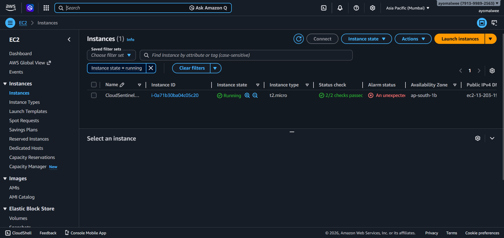
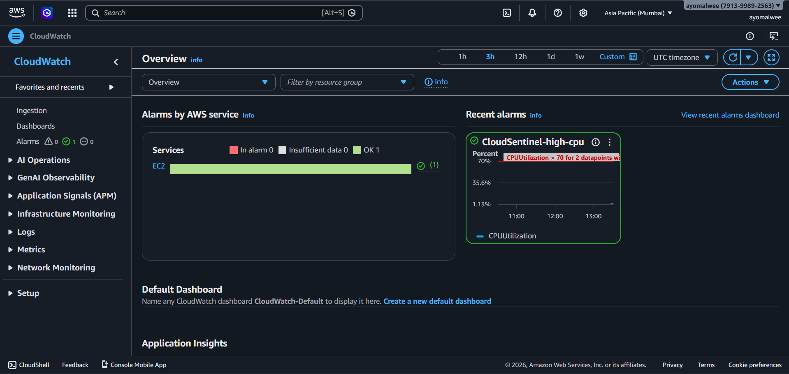
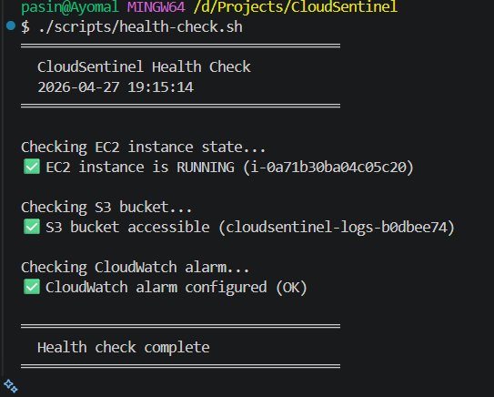

# 🛡️ CloudSentinel — Automated Infrastructure Health Monitor


> A Terraform-provisioned AWS infrastructure stack that **deploys itself,
> monitors its own health, and tears itself down cleanly** — demonstrating
> Infrastructure-as-Code, cloud observability, and SRE-aligned automation
> in a single end-to-end project.

---

## 💡 The Concept

Infrastructure-as-Code means treating your cloud resources the same way
you treat application code — version controlled, reviewable, repeatable,
and automatically validated on every change.

CloudSentinel demonstrates this principle end-to-end:

```
Write .tf files  →  terraform apply  →  AWS builds infrastructure
       ↓                                         ↓
  git push       →  GitHub Actions validates  ←  CloudWatch monitors
       ↓
terraform destroy  →  Clean teardown, zero orphaned resources
```

---

## 📸 Screenshots

### terraform apply — Infrastructure Provisioned
<!-- Replace with your actual screenshot -->
 n

### AWS Console — EC2 Instance Running
<!-- Replace with your actual screenshot -->


### AWS CloudWatch — Dashboard Live
<!-- Replace with your actual screenshot -->


### Health Check Script — All Green
<!-- Replace with your actual screenshot -->


### GitHub Actions — Terraform Validate Green
<!-- Replace with your actual screenshot -->


### terraform destroy — Clean Teardown
<!-- Replace with your actual screenshot -->


---

## 🚀 Quick Start

### Prerequisites
- [Terraform](https://developer.hashicorp.com/terraform/install) installed
- [AWS CLI](https://aws.amazon.com/cli/) configured (`aws configure`)
- AWS Free Tier account

### Deploy

```bash
# Clone
git clone https://github.com/ayovz/CloudSentinel.git
cd CloudSentinel

# Initialise Terraform
terraform -chdir=terraform init

# Preview what will be created (nothing built yet)
terraform -chdir=terraform plan

# Build everything on AWS
terraform -chdir=terraform apply -auto-approve
```

### Verify

```bash
# Run health checks against live infrastructure
chmod +x scripts/health-check.sh
./scripts/health-check.sh
```

Expected output:
```
═══════════════════════════════════════
  CloudSentinel Health Check
  2026-04-27 10:30:00
═══════════════════════════════════════

✅ EC2 instance is RUNNING (i-0abc123def456789)
✅ S3 bucket accessible (cloudsentinel-logs-a1b2c3d4)
✅ CloudWatch alarm configured (OK)

═══════════════════════════════════════
  Health check complete
═══════════════════════════════════════
```

### Destroy

```bash
# Remove ALL AWS resources cleanly
terraform -chdir=terraform destroy -auto-approve
```

---

## 📁 Project Structure

```
📦 CloudSentinel
 ┣ 📂 terraform
 ┃ ┣ 📄 provider.tf        ← AWS provider + Terraform version
 ┃ ┣ 📄 variables.tf       ← Configurable inputs (region, type, thresholds)
 ┃ ┣ 📄 main.tf            ← All AWS resources defined as code
 ┃ ┗ 📄 outputs.tf         ← Instance IP, bucket name, dashboard URL
 ┣ 📂 scripts
 ┃ ┗ 📄 health-check.sh    ← Bash health verification script
 ┣ 📂 .github/workflows
 ┃ ┗ 📄 terraform-plan.yml ← CI: validate + plan on every push
 ┣ 📂 screenshots           ← Evidence of working infrastructure
 ┣ 📄 README.md
 ┗ 📄 .gitignore
```

---

## 🏗️ What Gets Built

| Resource | Type | Purpose |
|----------|------|---------|
| `cloudsentinel-instance` | AWS EC2 (t2.micro) | Linux server — the compute resource |
| `cloudsentinel-logs-*` | AWS S3 Bucket | Log and artifact storage |
| `cloudsentinel-sg` | AWS Security Group | Firewall rules (SSH + HTTP) |
| `cloudsentinel-high-cpu` | CloudWatch Alarm | Alerts when CPU > 70% |
| `cloudsentinel-dashboard` | CloudWatch Dashboard | Real-time infrastructure metrics |

**Free Tier eligible.** All resources use `t2.micro` and standard S3 —
within AWS Free Tier limits when destroyed after use.

---

## ⚙️ Configuration

All variables are in `terraform/variables.tf`:

```hcl
variable "aws_region"          { default = "ap-south-1" }   # Mumbai
variable "instance_type"       { default = "t2.micro"   }   # Free tier
variable "project_name"        { default = "CloudSentinel" }
variable "cpu_alarm_threshold" { default = 70            }   # Alert at 70% CPU
```

Override at apply time:
```bash
terraform apply -var="aws_region=us-east-1" -var="cpu_alarm_threshold=80"
```

---

## 🤖 GitHub Actions CI

Every push to `main` automatically runs:

```
1. terraform init      ← Download AWS provider plugin
2. terraform validate  ← Check for syntax errors
3. terraform fmt       ← Check code formatting
4. terraform plan      ← Preview changes (dry run)
```

The plan runs against AWS using repository secrets — no credentials
in code. Add `AWS_ACCESS_KEY_ID` and `AWS_SECRET_ACCESS_KEY` to your
GitHub repo secrets before pushing.

---

## 🔍 SRE Concepts Demonstrated

| Concept | How CloudSentinel Shows It |
|---------|---------------------------|
| **Infrastructure-as-Code** | All resources defined in `.tf` files — no manual clicking |
| **Idempotency** | Run `apply` twice — same result, no duplicates |
| **Observability** | CloudWatch dashboard + CPU alarm configured as code |
| **Health Verification** | Automated Bash script validates live infrastructure |
| **CI/CD for IaC** | GitHub Actions validates every change before merge |
| **Toil Reduction** | One command deploys everything; one command destroys it |
| **Cost Discipline** | `terraform destroy` ensures no abandoned resources |

---

## 📊 Terraform State

Terraform tracks what it built in `terraform.tfstate`.
This file is in `.gitignore` — never commit it to a public repo
as it contains resource IDs and configuration details.

For team use, store state remotely in S3:
```hcl
terraform {
  backend "s3" {
    bucket = "my-terraform-state"
    key    = "cloudsentinel/terraform.tfstate"
    region = "ap-south-1"
  }
}
```

---

## 🧠 What I Learned Building This

- **HCL syntax** — Terraform's HashiCorp Configuration Language for declaring resources
- **AWS provider** — How Terraform authenticates and communicates with AWS APIs
- **Resource dependencies** — Terraform builds the Security Group before EC2 automatically
- **`terraform plan`** — The power of previewing infrastructure changes before applying
- **CloudWatch as code** — Defining alarms and dashboards declaratively, not via console
- **IaC lifecycle** — init → plan → apply → verify → destroy as a complete workflow
- **CI for infrastructure** — Why running `terraform validate` on every push matters

---

## 🔧 Extending CloudSentinel

- [ ] Add Ansible playbook for EC2 configuration management
- [ ] Add RDS database instance to the stack
- [ ] Add SNS topic for alarm notifications via email
- [ ] Add remote S3 backend for team state management
- [ ] Add Kubernetes (EKS) cluster configuration
- [ ] Add Prometheus + Grafana monitoring stack

---

## 👤 Author

**Ayomal Weerasinghe**
Final-year IT Undergraduate, SLIIT
Colombo, Sri Lanka

📧 pasinduayomal2001@gmail.com
🔗 [linkedin.com/in/ayomalwee](https://linkedin.com/in/ayomalwee)
💻 [github.com/ayovz](https://github.com/ayovz)

---

## 📄 License

MIT — free to use, modify, and distribute.
